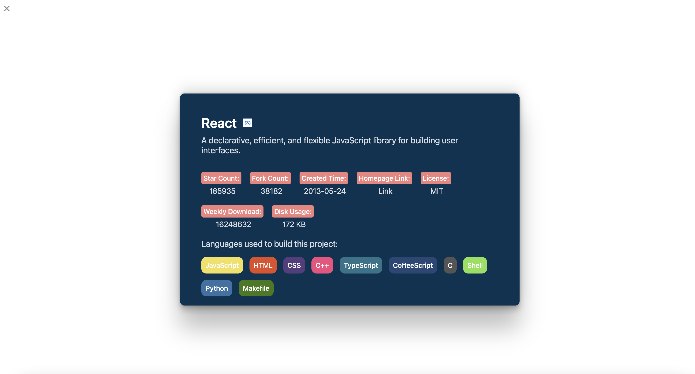

This is a [Next.js](https://nextjs.org/) project bootstrapped with [`create-next-app`](https://github.com/vercel/next.js/tree/canary/packages/create-next-app).

# Frontend Framework Trend

A simple webapp that display the trends and details of modern frontend development frameworks.
[](https://github.com/prettier/prettier)




## Installation

```shell
$ git clone https://github.com/kylemocode/frontend-framework-trend.git
$ cd frontend-framework-trend
$ npm install
$ npm run codegen (to automatically generate graphql relative types)
$ npm run dev
```

## Tech Stack

- [x] Next.js
- [x] TypeScript
- [x] Github GraphQL API
- [x] Apollo Client V3
- [x] graphql-codegen
- [x] styled-components
